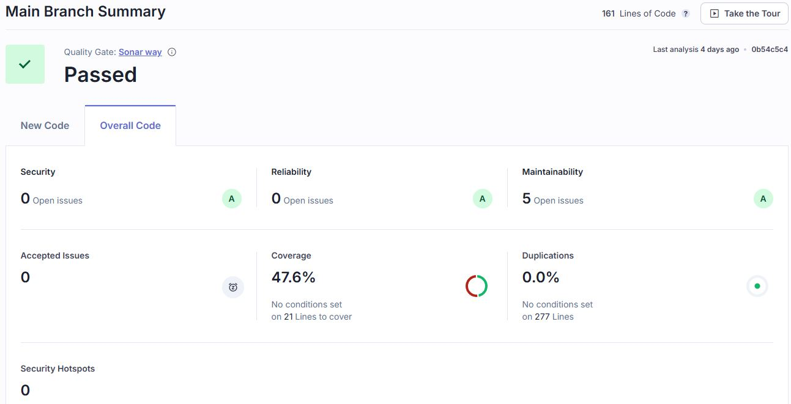
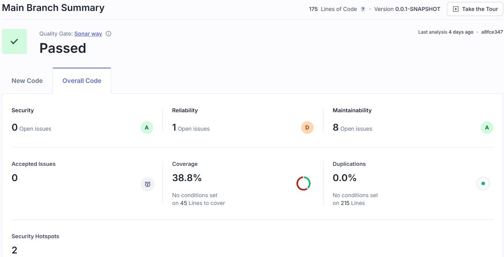
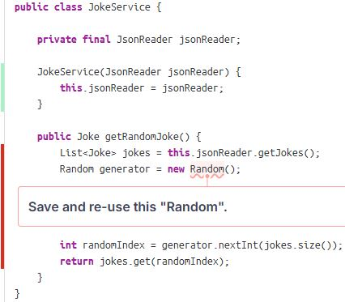
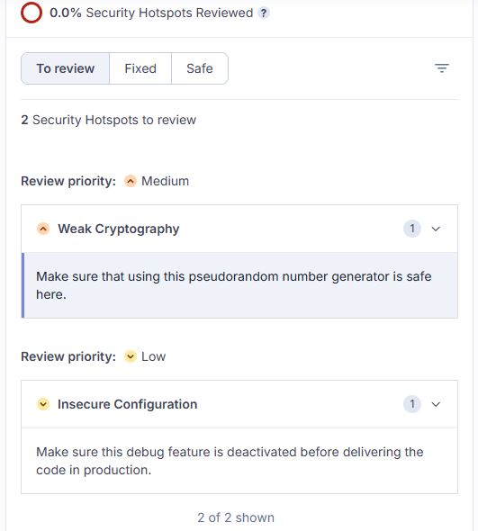
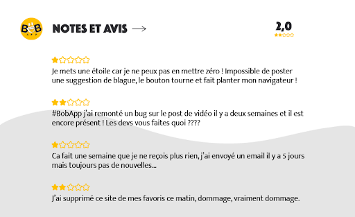

# Document explicatif

## 1. Étapes des GitHub Actions
### 1.1 Workflow des tests
#### _1.1.1 Objectif_
L’objectif de ce workflow est d'automatiser l’exécution des tests afin de garantir que le code est valide avant tout déploiement ou merge dans la branche principale.

#### _1.1.2 Étapes_
- Déclencheur : 
Le workflow est déclenché à chaque push ou pull request vers la branche principale ou toute autre branche de développement
- Définition de l'environnement : 
Utilisation de l’action actions/setup-node pour configurer un environnement Node.js (Angular) ou JDK (Java) selon le langage sur lequel est basé le projet.
- Installation des dépendances : 
L’installation des dépendances requises par le projet est effectuée à l’aide de npm install (Angular) ou mvn install (Java) selon le gestionnaire de paquets.
- Exécution des tests : 
L’exécution des tests est réalisée à l’aide de la commande appropriée npm test (Angular) ou mvn test (Java). Cette étape permet de vérifier que le code passe tous les tests unitaires et d’intégration.
- Vérification des résultats : 
Si les tests échouent, le workflow échoue et empêche toute fusion ou déploiement, garantissant ainsi la qualité du code.
- Archivage des résultats :  
Un rapport de test est généré et peut être archivé ou envoyé en tant qu'artefact de workflow.

### 1.2 Workflow de qualité
#### 1.2.1 _Objectif_
Le but de ce workflow est d’intégrer une analyse de la qualité du code via SonarQube afin de détecter les défauts, vulnérabilités et améliorer la maintenabilité du code.

#### _1.2.2 Étapes_
- Déclencheur : 
Ce workflow peut être configuré pour être déclenché sur les mêmes événements que le workflow des tests (par exemple, push ou pull_request).
- Définition de l’environnement SonarQube : 
L'outil SonarQube est configuré dans le pipeline CI en installant et configurant les actions nécessaires pour communiquer avec un serveur SonarQube.
- Authentification auprès de SonarQube : 
Pour que l’analyse de qualité fonctionne, on doit fournir un jeton d'authentification SonarQube via un secret GitHub (SONAR_TOKEN).
- Exécution de l’analyse de code avec SonarQube :
L’action SonarSource/sonarcloud-github-action ou une action personnalisée est utilisée pour lancer l’analyse de la qualité du code avec SonarQube. Cette analyse peut inclure l’analyse des duplications de code, l’identification de vulnérabilités de sécurité, le calcul de la couverture des tests, l’analyse des règles de code.
- Génération du rapport SonarQube :
Une fois l’analyse effectuée, les résultats sont envoyés à SonarQube où ils peuvent être consultés sous forme de rapport détaillé.

### 1.3 Workflow CI/CD
#### _1.3.1 Objectif_
L’objectif de ce workflow est d’automatiser le processus de build, de test et de déploiement des images Docker sur Docker Hub après que le code soit validé dans le dépôt.

#### _1.3.2 Étapes_
- Déclencheur :
Ce workflow est généralement déclenché à chaque push vers la branche principale ou une branche de version.
- Authentification Docker Hub :
Avant de pousser une image Docker sur Docker Hub, il est nécessaire de s'authentifier à Docker Hub à l’aide d’un identifiant et d’un mot de passe, généralement stockés en tant que secrets GitHub (DOCKER_USERNAME et DOCKER_PASSWORD).
- Construction de l’image Docker :
L’image Docker est construite en utilisant un fichier Dockerfile présent dans le dépôt. La commande docker build est exécutée pour créer l’image avec un tag approprié (par exemple, myapp:latest).
- Envoi de l’image sur Docker Hub :
Une fois l’image Docker construite, l’image est poussée vers Docker Hub en utilisant la commande docker push.

## 2. KPI proposés
### 2.1 Couverture de code
#### _2.1.1 Objectif_
Le couverture de code est un KPI essentiel qui permet de mesurer la proportion du code source qui est testée par des tests automatisés. L’objectif est de s’assurer qu'une partie suffisante du code est testée pour garantir sa fiabilité et sa stabilité.

#### _2.1.2 Seuil_
Le seuil minimum recommandé pour le code coverage est de 80%. Cela signifie que 80% du code doit être testé par des tests unitaires, d'intégration ou autres types de tests automatisés.

Ce seuil assure qu’une couverture importante est obtenue, réduisant ainsi le risque de bugs non détectés dans le code.

Un taux de couverture trop bas pourrait indiquer que des parties importantes du code ne sont pas couvertes par des tests et qu'il existe des risques de régressions ou de défaillances dans les fonctionnalités.

Si le code coverage descend en dessous de 80%, une alerte sera déclenchée. Le but est de forcer l’équipe de développement à ajouter des tests supplémentaires pour garantir que le code est suffisamment testé avant de procéder à un déploiement ou une mise en production.

### 2.2 Security Hotspots
#### _2.2.1 Objectif_
L'objectif de ce KPI est de garantir que tous les Security Hotspots identifiés dans le code sont évalués et résolus afin d'assurer une sécurité maximale du projet.

Un Security Hotspot est une partie du code qui présente un risque potentiel pour la sécurité. Ce KPI mesure le pourcentage de ces zones de risque qui ont été inspectées, corrigées ou validées par les développeurs pour garantir qu'aucune menace n'est présente.

#### _2.2.2 Seuil_
Le seuil recommandé est de 100 % des Security Hotspots devant être inspectés et résolus. Cela implique que tous les Security Hotspots signalés par SonarQube doivent tous être traités.

Ce KPI permet d'assurer que le code est examiné pour des vulnérabilités potentielles et qu'aucune zone de risque n'est négligée.

Il garantit que l'application respecte les normes de sécurité requises, ce qui est essentiel dans des environnements de production sensibles.

En résolvant tous les Security Hotspots, les risques d'attaques ou de fuites de données liées à des vulnérabilités non corrigées sont minimisés.

## 3. Analyse des métriques et des avis utilisateurs
### 3.1 Analyse des métriques
#### _3.1.1 Front-end_

La couverture de code de 47,6 % est trop basse. Il est recommandé d’ajouter davantage de tests unitaires, d'intégration et de tests fonctionnels pour atteindre au moins 80% de couverture de code.

#### _3.1.2 Back-end_

La couverture de code de 38,8 % est également trop basse. Comme pour la partie front-end, il faudrait prioriser les tests sur les parties les plus critiques du code, telles que celles qui touchent aux fonctionnalités principales, afin d’atteindre au moins 80% de couverture de code.

Ce message d’erreur indique que le code utilise un objet Random de manière inefficace en le créant à chaque appel de la méthode. En effet, la création répétée d'instances de Random peut entraîner une perte de performance, surtout dans un contexte où la méthode est appelée fréquemment, car la création d'un objet Random est relativement coûteuse. 

Afin de corriger ce problème, il faudrait déclarer l'objet Random en tant que membre de la classe, et l'initialiser une seule fois dans le constructeur ou directement lors de sa déclaration.

Enfin, il reste 2 problèmes de type Security Hotspot à corriger pour atteindre un résultat de 100 % contre 0 % actuellement.

Le première recommandation serait d’utiliser SecureRandom au lieu de Random pour améliorer la sécurité de la génération de nombre aléatoire.

Le deuxième message indique qu’une fonctionnalité de debug devrait être désactivée avant de mettre le code en production.

### 3.2 Analyse des avis utilisateurs

#### _3.2.1 Problème de soumission de suggestions de blagues_
- Retour utilisateur : Le bouton pour soumettre une suggestion de blague fait planter le navigateur.
- Impact : Empêche l’utilisation d’une fonctionnalité clé, provoque une mauvaise expérience utilisateur.
- Action : Priorité haute. Corriger rapidement ce bug pour restaurer la fonctionnalité.

#### _3.2.2 Bug de publication de vidéos_
- Retour utilisateur : L’utilisateur se plaint qu’un bug lié à la publication de vidéos n’a toujours pas été résolu.
- Impact : Frustration de l’utilisateur et perte de confiance envers l’équipe de développement.
- Action : Priorité moyenne à haute. Résoudre ce bug et améliorer la réactivité du support.

#### _3.2.3 Problème de non-réception de contenu et absence de réponse du support_
- Retour utilisateur : L’utilisateur ne reçoit plus de notifications depuis une semaine et n’a pas eu de réponse à son email envoyé il y a 5 jours.
- Impact : Frustration et risque de désengagement de l’utilisateur.
- Action : Priorité moyenne. Résoudre le problème de notifications et répondre rapidement aux emails du support.

#### _3.2.4 Insatisfaction générale, suppression des favoris_
- Retour utilisateur : L’utilisateur a supprimé l’application de ses favoris sans fournir de détails spécifiques.
- Impact : Indication d’un désengagement, probablement lié à des problèmes de performance ou de bugs non résolus.
- Action : Priorité moyenne. Identifier et résoudre les problèmes généraux d’expérience utilisateur.

